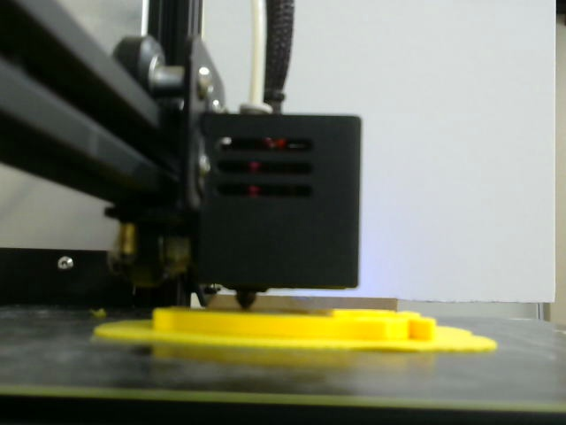
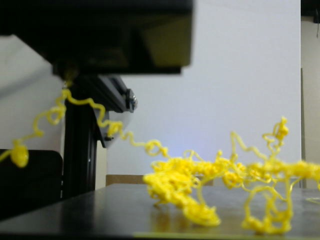
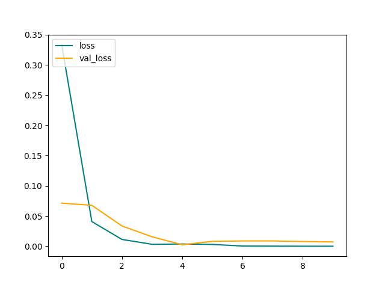

# Image Classification of 3d printer models.
## Overview
A project in progress.  I am learning more about Tensorflow through an image classification NN.   
The purpose of this project is to classify the quality of prints from a 3D printer as good or bad quality (See below for images).  The applications of this project could help manufacturers quickly identify and stop faulty machinery sooner.  By stopping bad production early, a company can reduce waste and maximize profit.  

### Good Print

### Bad Print

## Results
Most of the loss was reduced after 2 epochs, see below.  The final accuracy of the neural network on the test set was 1.0 indicating strong performance in predicting 3D print quality.  

## Current Status
1. Data clean to look for corrupt images or images not in JPG format.  
2. Data pipeline created through Tensorflow to import images into neural network training.  
3. Images have been scaled as a part of the preprocessing.
4. Separate training, validation, and test sets.
5. Train Neural network
6. Test Neural Network 

## Future steps
7. Clean up code for future use

## Thanks! 
- Big thanks to Justin Ruan over at Kaggle for this data!
  - https://www.kaggle.com/datasets/justin900429/3d-printer-defected-dataset
- Big thanks to Nicholas Renotte on Youtube for walking me through Tensorflow.
  - https://www.youtube.com/watch?v=jztwpsIzEGc

